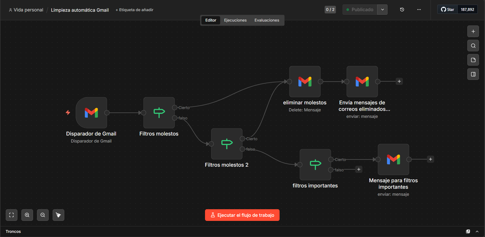

# Gestor de correos Gmail

Limpia la bandeja de entrada sin tener el PC encendido: manda a la papelera los correos molestos y avisa cuando llega uno importante.

Los molestos **no se borran para siempre**. Van a la papelera de Gmail y se pueden recuperar unos 30 días.

## Cómo funciona

Cada 6 horas, GitHub Actions ejecuta el proceso:

1. Pide los correos que llegaron a la bandeja en las últimas horas.
2. Compara el remitente con `senders.json`.
3. Si está en `unwanted`, lo manda a la papelera. Si está en `important`, lo deja donde está y lo incluye en el aviso.
4. Envía un resumen a la propia cuenta: qué se tiró, qué no se pudo tirar y qué hay que revisar.

Lo que no está en ninguna lista se queda intacto. Si no hay nada que contar, no manda correo.

También se puede lanzar a mano desde la pestaña Actions, con la opción de simular: revisa y envía el resumen sin mover nada.

## Listas de remitentes

Edita `senders.json` para añadir o quitar direcciones. No hace falta tocar nada más. El programa valida el archivo antes de actuar y falla si una dirección tiene mal formato, está repetida o aparece en las dos listas, porque una lista mal escrita significa correos a la papelera por error.

**Molestos:** Spotify, Computrabajo, Humand, YouTube, Fondex, Adobe, Lovable, Temu, Lucid, Davivienda, PayPal.

**Importantes:** Platzi, LinkedIn.

## Arranque

Node.js 22.18 o superior, porque el proceso ejecuta TypeScript sin compilar.

```bash
npm install
cp .env.example .env   # rellena tus valores, ver Acceso a Gmail
npm run dev
```

Las credenciales son tuyas y **no se guardan en el repositorio**. En tu equipo van en `.env`, que está en `.gitignore` y nunca se sube; `npm run dev` lo lee. En GitHub Actions no existe ese archivo: ahí llegan desde los secrets del repositorio, y `npm start` las toma del entorno. Si falta alguna, el proceso no arranca y dice cuál.

Empieza con `DRY_RUN=true`: revisa la bandeja y te manda el resumen sin mover nada.

`npm test` corre las pruebas. `npm run lint` el lint. `npm run typecheck` los tipos. En cada push a `main` y en cada pull request, GitHub Actions repite los tres.

## Acceso a Gmail

Se pide una sola vez, y todo pasa por tu equipo:

1. En Google Cloud, crea un proyecto y habilita la **API de Gmail**.
2. En la pantalla de consentimiento, déjala en modo de prueba y añade tu cuenta como usuario de prueba.
3. Crea una credencial OAuth de tipo **aplicación de escritorio**, que es la que corresponde a un proceso sin navegador. De ahí salen el client ID y el client secret.
4. Ponlos en tu `.env` y ejecuta `npm run auth`. Abre la dirección que imprime, concede el permiso y el proceso te devuelve el refresh token. Cópialo a `.env` como `GMAIL_REFRESH_TOKEN`.
5. Guarda los tres valores como secrets del repositorio. `gh` los pide por teclado y no los muestra:

```bash
gh secret set GMAIL_CLIENT_ID
gh secret set GMAIL_CLIENT_SECRET
gh secret set GMAIL_REFRESH_TOKEN
```

`gmail.modify` es el alcance mínimo que sirve: permite mover a la papelera y enviar el resumen, y **no** permite borrar para siempre.

El consentimiento usa PKCE con método S256 y un `state` aleatorio, y el servidor que recibe la respuesta escucha solo en `127.0.0.1`, en un puerto que asigna el sistema. El refresh token se imprime en la terminal y no se guarda en ningún archivo: llévalo a los secrets y cierra la terminal.

Si una credencial se te escapa, restablécela en Google Cloud y revoca el acceso de la aplicación desde la configuración de tu cuenta de Google. El client secret solo sirve acompañado de tu consentimiento, pero **un refresh token filtrado da acceso de escritura a tu correo hasta que lo revoques**.

## Privacidad

Este repositorio **no debe incluir** tu correo personal, contraseñas ni credenciales de Google.

- El resumen sale hacia la cuenta de Gmail conectada. El programa le pregunta la dirección a la API, así que no hay ningún correo escrito en el código.
- No subas archivos `credentials.json`, `token.json` ni `.env`.
- Los secretos viven en GitHub Secrets. Ningún mensaje de error incluye la respuesta de Google, para que un log no termine mostrando un token.

## Código

Node.js y TypeScript, **sin dependencias en tiempo de ejecución**: la API de Gmail se consume por HTTP con `fetch`. Las dependencias del `package.json` son solo de desarrollo (pruebas, lint y tipos), y por eso el workflow de limpieza no instala nada antes de correr.

- `src/auth/` pide el permiso la primera vez: PKCE, `state` y un loopback que espera la redirección.
- `src/gmail/` habla con la API: token, cliente con reintentos y espera exponencial, y normalización de la respuesta.
- `src/inbox/` es el dominio: validar las listas, reducir el remitente a una dirección comparable y clasificar.
- `src/report/` redacta el resumen.
- `src/main.ts` ordena los pasos.

Todo lo que puede romperse en silencio tiene prueba: el parseo de remitentes, la validación de las listas, la clasificación, el formato del correo y el cliente de Gmail con un `fetch` falso.

## Cómo llegó hasta aquí

Fue mi primer proyecto y lo he hecho tres veces.

**Uno, en n8n, sobre el PC.** Funcionaba, pero solo con el equipo encendido.



**Dos, como automatización de Cursor en la nube**, leyendo `senders.json` de este repositorio. Quitó la dependencia del PC, pero la lógica vivía en una herramienta, no en código que se pueda leer ni probar.

**Tres, este código**, con cron en GitHub Actions y pruebas. Misma idea, ahora con las reglas explícitas, el alcance mínimo y errores manejados.

`Limpieza automática Gmail.json` es el export original de n8n, por si quieres importarlo en n8n Cloud. Es opcional y ya no es el camino principal. Si lo importas:

1. Conecta tu propia credencial de Gmail en n8n.
2. Cambia `YOUR_EMAIL@gmail.com` por tu correo **solo dentro de n8n**, no en el archivo del repositorio.
3. Actívalo en n8n Cloud, no en local.
